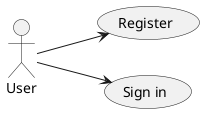

# PlantUML

## Markdown integration

### PlantUML code block


```plantuml
@startuml
left to right direction

actor User
User --> (Register)
User --> (Sign in)

@enduml
```

### PlantUML diagram image (using proxy service)


```markdown

```


